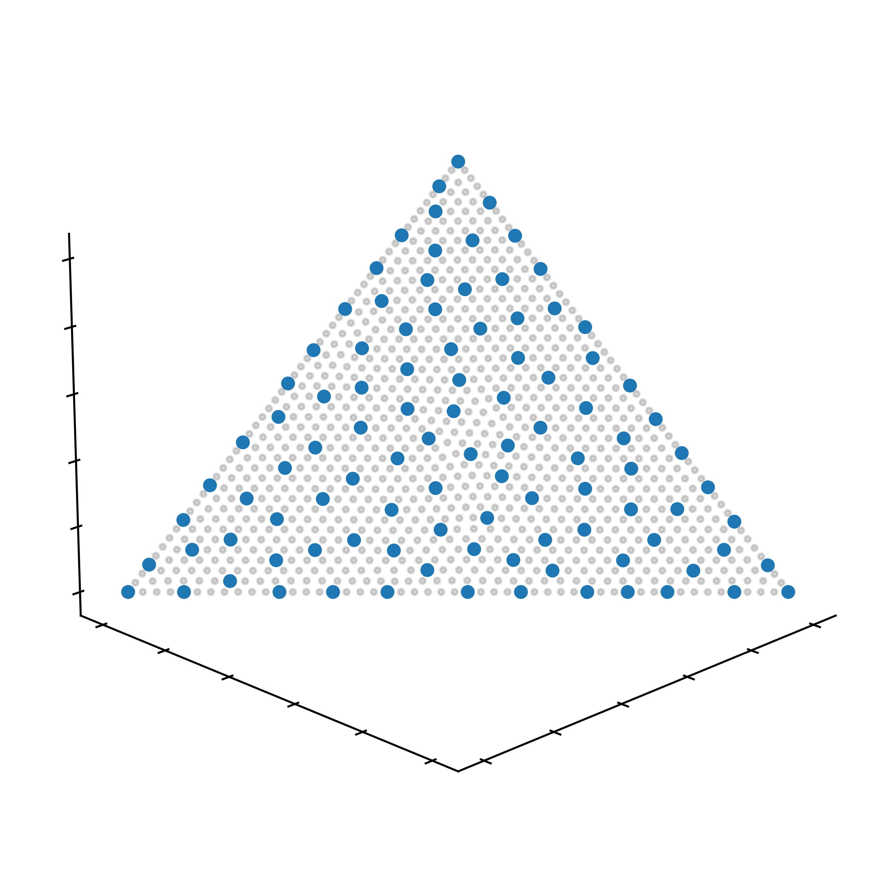

# issp_ls_clist

This repository provides the C++ implementation of faster local search for indicator-based subset selection problem proposed in the following paper:

> TODO: paper info


# Requirements
+ `boost`
+ `pagmo`

I compiled this code with GNU C++ compiler 11.1.0. 


# Usage
After compiling the code by `make`, the following example can be performed. 
```
./selector -point_set_file_path ./ref_point_dataset/linear_d3_n1000.csv -point_subset_size 100 -q_indicator hv -selector_alg fils-rlist-nlist -seed 0 -out_point_subset_file_path ./result/pf-linear_d3_n1000_k100_I-hv_alg-fils-rlist-nlist_rsz20_nsz20/subset_0th_run.csv -out_qi_file_path ./result/pf-linear_d3_n1000_k100_I-hv_alg-fils-rlist-nlist_rsz20_nsz20/qi_0th_run.csv -out_time_file_path ./result/pf-linear_d3_n1000_k100_I-hv_alg-fils-rlist-nlist_rsz20_nsz20/time_0th_run.csv -out_n_qi_calls_file_path ./result/pf-linear_d3_n1000_k100_I-hv_alg-fils-rlist-nlist_rsz20_nsz20/n_qi_calls_0th_run.csv -nlist_size 20 -rlist_size 20 -hv_ref_point_val 1.1
```

then the following files is generated in a directory `./result/pf-linear_d3_n1000_k100_I-hv_alg-fils-rlist-nlist_rsz20_nsz20`
+ `n_qi_calls_0th_run.csv` the number of evaluations by quality indicator
+ `qi_0th_run.csv` the quality indicator value
+ `subset_0th_run.csv` selected point subset
+ `time_0th_run.csv` the execution time

`args.py` generates command. Parameters are at the beginning of this file. 
+ `d = 3` the number of objectives is $3$. 
+ `n = 1000` the size of point set is $1000$. 
+ `k = 100` the size of point subset is $100$. 
+ `pf = 'linear'` the shape of Pareto front is "linear". 
+ `I = 'hv'` the quiality indicator is hypervolume. 
+ `alg = 'fils-rlist-nlist'` the selector algorithm is LS-RN.
+ `rlist_size = 20` the size of random neighbor list is $20$. 
+ `nlist_size = 20` the size of nearest neighbor list is $20$. 
+ `id = 0` the random seed is $0$. 

The gray points are the original point set and the blue points are the selected point subset:
<div align="center">
    
</div>